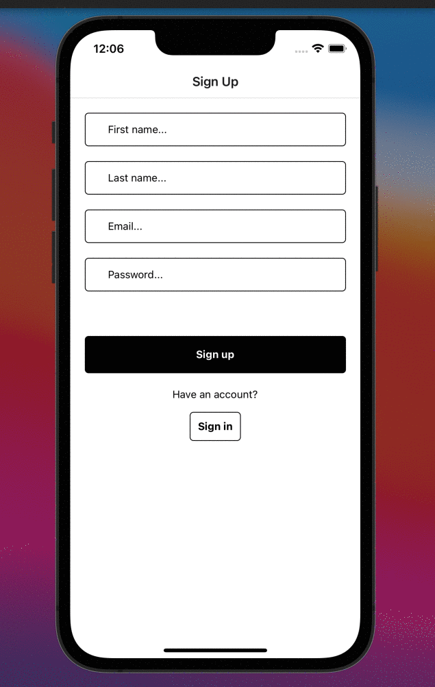
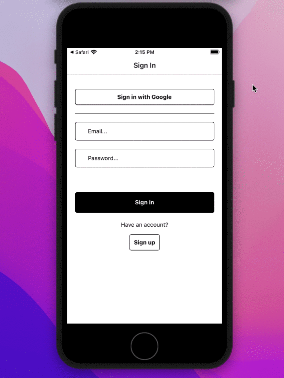
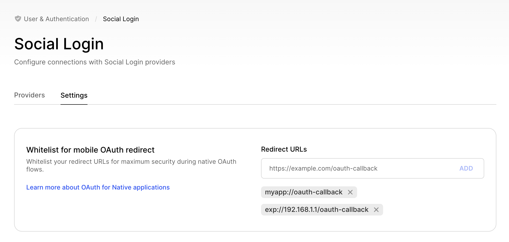

  <a href="https://clerk.dev?utm_source=github&utm_medium=clerk_expo" target="_blank">
    <picture>
      <source media="(prefers-color-scheme: dark)" srcset="./docs/clerk-logo-dark.png">
      
    </picture>
  </a>
   

# Clerk Expo Starter

This starter project shows how to use [Clerk](https://www.clerk.dev/?utm_source=github&utm_medium=starter_repos&utm_campaign=expo_starter) with [Expo](https://expo.dev/) to authenticate users in your [React Native](https://reactnative.dev/) application. When users sign up or sign in, Clerk handles the state of the authentication and switches between public or [protected routes](https://reactnavigation.org/docs/auth-flow).

---

**Clerk is Hiring!**

Would you like to work on Open Source software and help maintain this repository? [Apply today!](https://apply.workable.com/clerk-dev/)

---

## Demo

### Sign up using One-time passcodes (OTP) & Sign in using OAuth

  
  

## Getting Started

### Prerequisites

- React v16+
- Node.js v14+

### Setup

To run the example locally you need to:

1. Sign up at [Clerk.dev](https://www.clerk.dev/?utm_source=github&utm_medium=starter_repos&utm_campaign=expo_starter).
2. Go to your [Clerk dashboard](https://dashboard.clerk.dev/?utm_source=github&utm_medium=starter_repos&utm_campaign=expo_starter) and create an application.
3. Set your publishableKey in `App.tsx` or if you are using a legacy key frontendApi
4. `npm i` to install the required dependencies.
5. `npm run start` to launch the Expo development server.

### Sign up & Sign in configuration

For the sign up flow to work as demonstrated, you need to log into your [Clerk Dashboard](https://dashboard.clerk.dev/?utm_source=github&utm_medium=starter_repos&utm_campaign=expo_starter) and make sure the following settings have been configured in **User & Authentication** and **Social login** sections:

#### For development instances

1. In Contact information section enable **Email Address** and pick **Email verification code** method in the modal.
2. In Authentication factors section enable **Password** and **Email verification code**.
3. In Personal information, enable **Name** to use first and last names during sign up
4. In Social Login, enable **Google** Oauth provider.

#### For production instances

1. Follow all the steps above
2. Whitelist your custom redirect URL via [Clerk Dashboard](https://dashboard.clerk.dev/last-active?path=/user-authentication/social-login) for maximum security during native OAuth flows.
   

## Learn more

To learn more about Clerk and Expo, take a look at our
[official documentation](https://reference.clerk.dev/reference/clerk-expo?utm_source=github&utm_medium=starter_repos&utm_campaign=expo_starter).

## Support

You can get in touch with us in any of the following ways:

- Join our official community [Discord server](https://discord.com/invite/b5rXHjAg7A)
- Open a [GitHub support issue](https://github.com/clerkinc/javascript/issues/new?assignees=&labels=question&template=ask_a_question.md&title=Support%3A+)
- Contact options listed on [our Support page](https://clerk.dev/support?utm_source=github&utm_medium=clerk_expo_starter)
