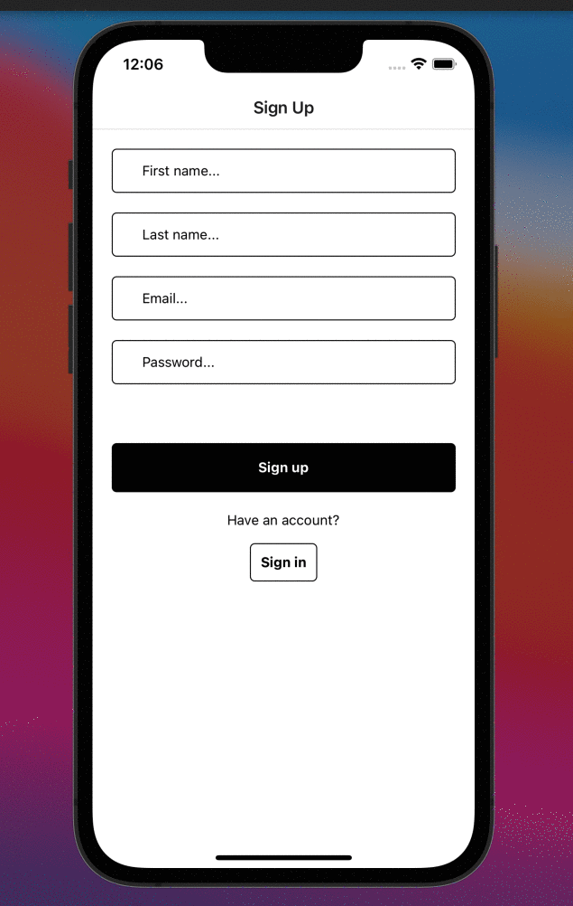

# Clerk Expo Starter

This starter project shows how to use [Clerk](https://www.clerk.dev/?utm_source=github&utm_medium=starter_repos&utm_campaign=expo_starter) with [Expo](https://expo.dev/) to authenticate users in your [React Native](https://reactnative.dev/) application. When users sign up or sign in, Clerk handles the state of the authentication and renders public or [protected routes](https://reactnavigation.org/docs/auth-flow).

## Demo

## How to use

To run the example locally you need to:

1. Sign up at [Clerk.dev](https://www.clerk.dev/?utm_source=github&utm_medium=starter_repos&utm_campaign=expo_starter).
2. Go to [Clerk's dashboard](https://dashboard.clerk.dev/?utm_source=github&utm_medium=starter_repos&utm_campaign=expo_starter) and create an application.
3. Set your Frontend API key in `App.tsx`.
4. `yarn` to install the required dependencies.
5. `yarn start` to launch the Expo development server.

## Learn More

To learn more about Clerk.dev and Expo, take a look at the
[official documentation](https://docs.clerk.dev/reference/clerk-expo-beta?utm_source=github&utm_medium=starter_repos&utm_campaign=expo_starter).

## Having trouble ?

If you find any bug, something is not working as expected or you would like to see if we can support your use case, you can reach out to any of our [support channels](https://clerk.dev/support?utm_source=github&utm_medium=starters&utm_campaign=expo_starter), or just open a new issue!
